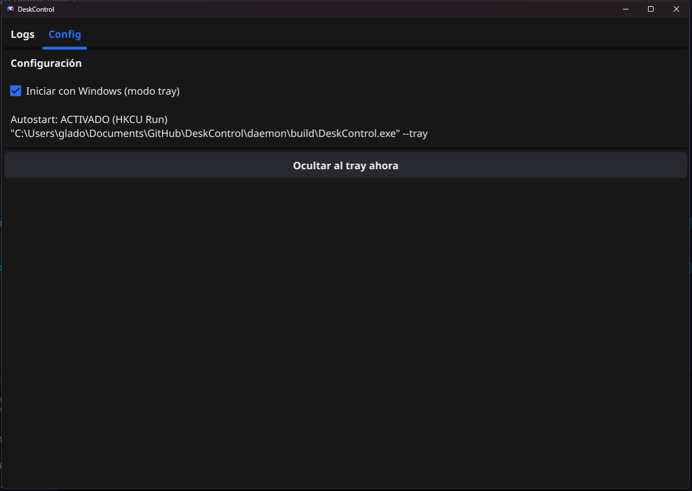
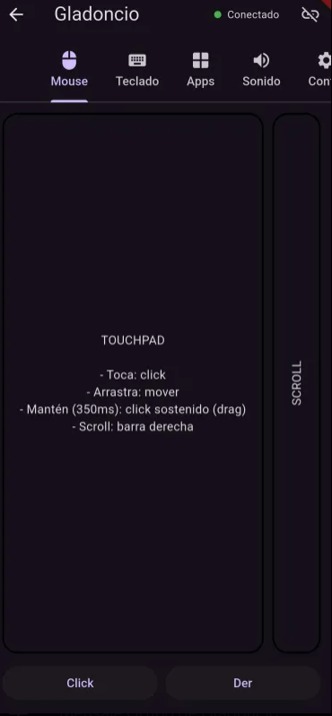

# DeskControl

**DeskControl** es una aplicación **gratuita** de control remoto de PC desde el teléfono móvil, pensada para ser **rápida, liviana y moderna**, sin depender de servicios externos ni configuraciones complejas.

Permite controlar tu computadora **directamente desde tu smartphone**, usando la red local, con foco en productividad, presentaciones, control multimedia y uso diario.

---

## ✨ ¿Qué es DeskControl?

DeskControl es una solución completa compuesta por:

- 🖥️ **DeskControl Daemon (PC / Windows)**  
- 📱 **DeskControl Mobile App (Android)**  

Ambos componentes se comunican entre sí de forma **local y segura**, sin cuentas, sin cloud y sin internet.

---

## 📸 Capturas

### Desktop (Daemon + UI)


### Mobile App


---

## 🚀 Principales características

### 🖥️ En la computadora (Daemon)
- Aplicación **de bajo consumo**
- Puede ejecutarse en **segundo plano** (system tray)
- Inicio automático con Windows (opcional)
- Descubrimiento automático desde el móvil
- UI integrada para:
  - Ver logs en tiempo real
  - Ver estado del daemon
  - Configuración básica
- Control total del sistema:
  - Movimiento del mouse
  - Click simple y click sostenido (drag)
  - Scroll configurable
  - Entrada de teclado
  - Acciones remotas

Todo está desarrollado en **Go**, priorizando rendimiento y estabilidad.

---

### 📱 En el teléfono (App móvil)
- Descubre el PC automáticamente en la red local
- Conexión rápida y estable
- Funciona como:
  - Mouse remoto
  - Touchpad avanzado
  - Control por gestos
  - Teclado remoto
- Acciones diferenciadas:
  - Mover
  - Click
  - Click mantenido (drag & drop)
  - Scroll lateral
- Configuración persistente:
  - Sensibilidad
  - Velocidad de scroll
  - Comportamiento de gestos
- Pensada para uso continuo, sin reconexiones constantes

Desarrollada en **Flutter**, optimizada para Android.

---

## 🔗 ¿Cómo funciona?

```
┌────────────┐        WebSocket        ┌───────────────┐
│  Mobile    │  <------------------>  │   Daemon PC   │
│  Flutter   │                         │   Go + Fyne   │
└────────────┘        UDP Discovery    └───────────────┘
```

- **UDP** → Descubrimiento automático del PC
- **WebSocket** → Comunicación en tiempo real
- Todo ocurre **en la red local**, sin servidores externos

---

## 🧩 Filosofía del proyecto

- ✅ Gratuito
- ✅ Sin cuentas
- ✅ Sin publicidad
- ✅ Sin cloud
- ✅ Bajo consumo
- ✅ Extensible
- ✅ Pensado para crecer

DeskControl está diseñado como un **daemon real**, no como una app pesada, y como una app móvil **simple y eficiente**.

---

## 📦 Estructura del repositorio

```
DeskControl/
├── daemon/        # Daemon + UI de escritorio (Go)
├── mobile/        # App móvil (Flutter)
├── imagenes/      # Capturas de pantalla
├── README.md
├── BUILD_DAEMON.md
├── BUILD_MOBILE.md
└── .gitignore
```

---

## 🛠️ Tecnologías

### Desktop
- Go
- Fyne
- WebSocket
- UDP
- APIs de input de Windows

### Mobile
- Flutter
- Dart
- Gestos táctiles
- Base de datos local

---

## 📥 Builds y uso

- 🖥️ **Windows**: `.exe` con interfaz gráfica (sin consola)
- 📱 **Android**: APK distribuible (Release 1.1)

Las guías completas de compilación están disponibles en:

- [`BUILD_DAEMON.md`](./BUILD_DAEMON.md)
- [`BUILD_MOBILE.md`](./BUILD_MOBILE.md)

---

## 🧭 Estado del proyecto

- ✔ Funcional
- ✔ Release 1.1
- 🔧 En mejora continua
- 🐧 Soporte Linux planeado

---

## 📄 Licencia

Este proyecto es **gratuito**.  
La licencia puede definirse (MIT / Apache / GPL) según se requiera.

---

## 💡 Motivación

DeskControl nace para ofrecer una alternativa **simple, local y confiable** a soluciones de control remoto complejas, pensada para:

- Presentaciones
- Control multimedia
- Uso diario desde el teléfono
- Automatización ligera del escritorio

Sin depender de internet ni servicios externos.

---

**DeskControl — Controla tu PC desde el teléfono, sin complicaciones.**
