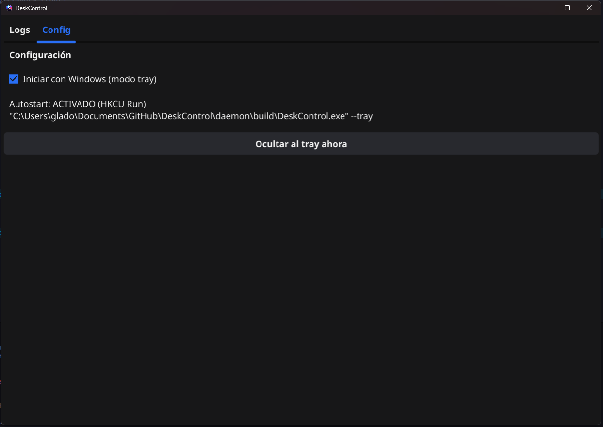
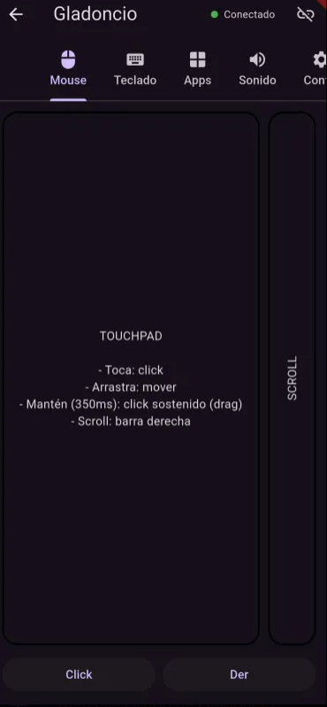

# DeskControl

Control remoto del PC desde el móvil — ratón, teclado, aplicaciones y sonido.

## Descripción

**DeskControl** es un sistema cliente-servidor que permite controlar un ordenador de escritorio desde un dispositivo móvil (Android/iOS) a través de la red local (LAN). Consta de dos componentes principales:

- **Daemon** (`daemon/`): Servidor escrito en Go con interfaz gráfica Fyne que se ejecuta en el PC. Expone un servidor WebSocket (con soporte TLS opcional) y un servicio de descubrimiento UDP.
- **App móvil** (`app/`): Aplicación Flutter que se conecta al daemon y proporciona una interfaz táctil para control remoto.

## Componentes

| Componente | Directorio | Tecnología | Plataformas |
|---|---|---|---|
| **Daemon** | `daemon/` | Go + Fyne UI | Linux, Windows |
| **App móvil** | `app/` | Flutter / Dart | Android, iOS |

## Capturas

| Daemon | App móvil |
|--------|-----------|
|  |  |

## Características

### Daemon (PC)
- **Simulación de entrada**: Soporta múltiples backends según la plataforma:
  - **Linux**: `uinput` (kernel input subsystem), `XTest` (X11 fallback), captura de teclas via `evdev`, D-Bus AT-SPI o X11
  - **Windows**: `SendInput` (Win32 API nativa), captura de teclas via hook de teclado
- **Descubrimiento automático**: Servicio UDP que responde a broadcasts de la app móvil en LAN
- **Servidor WebSocket**: Canal de control principal en puerto `54545`, con soporte TLS (autofirmado), autenticación por token y/o por usuario/contraseña (bcrypt)
- **Interfaz gráfica**: Ventana de configuración con pestañas de Logs, Config y Usuarios, bandeja del sistema (system tray), QR de emparejamiento
- **Listado de ventanas**: Obtiene lista de ventanas abiertas (X11/KWin/GNOME Shell en Linux, `EnumWindows` en Windows)
- **Registro de eventos**: Logs rotativos en archivo con visor en vivo
- **SQLite**: Almacenamiento de configuración y usuarios
- **Autostart**: Registro para inicio automático con el sistema

### App móvil
- **Descubrimiento por UDP**: Escanea la red local y muestra los daemons disponibles
- **Emparejamiento por QR**: Escanea un código QR generado por el daemon con todos los parámetros de conexión
- **Conexión segura**: Soporta WSS (TLS con certificate pinning) y payload cifrado con AES-256-GCM
- **Ratón táctil**: Touchpad con gestos, clic izquierdo/derecho, scroll
- **Teclado remoto**: Teclas virtuales configurables, combinaciones (combos), entrada de texto, captura de teclas desde el PC
- **Control de aplicaciones**: Lista y gestiona ventanas abiertas (activar, minimizar, maximizar, cerrar)
- **Control de sonido**: Volumen +/-, mute, controles multimedia (anterior, reproducir/pausa, siguiente)
- **Configuración**: Ajustes de sensibilidad del ratón, velocidad de scroll, delay de pulsación, tema claro/oscuro/sistema
- **Reconexión automática**: Backoff exponencial ante pérdida de conexión

## Arquitectura

```
┌─────────────────────────────────────────────────────────┐
│                     DAEMON (Go + Fyne)                    │
│                                                          │
│  ┌──────────────────────────────────────────────────┐   │
│  │              cmd/deskcontrol-ui                    │   │
│  │  ┌──────────┐ ┌───────────┐ ┌──────────────────┐ │   │
│  │  │ Logs Tab │ │ Config Tab│ │  Users Tab       │ │   │
│  │  └────┬─────┘ └─────┬─────┘ └───────┬──────────┘ │   │
│  │       │              │               │            │   │
│  │  ┌────┴─────┐  ┌────┴─────┐  ┌──────┴─────────┐  │   │
│  │  │ loghub   │  │ ui_db    │  │ ui_users_store │  │   │
│  │  └────┬─────┘  └──────────┘  └────────────────┘  │   │
│  └───────┼──────────────────────────────────────────┘   │
│          │                                              │
│  ┌───────┴──────────────────────────────────────┐       │
│  │            startCoreFromConfig()              │       │
│  │  ┌─────────────────┐ ┌────────────────────┐  │       │
│  │  │ discovery.UDP   │ │ ws.WebSocket       │  │       │
│  │  │ (puerto 54546)  │ │ (puerto 54545)     │  │       │
│  │  └─────────────────┘ └────────┬───────────┘  │       │
│  └───────────────────────────────┼────────────────┘       │
└──────────────────────────────────┼────────────────────────┘
                                   │ WebSocket (JSON)
┌──────────────────────────────────┼────────────────────────┐
│              APP (Flutter)        │                        │
│  ┌──────────────┐ ┌─────────────┐ │  ┌──────────────────┐ │
│  │ Discovery    │ │ Connection  │ │  │ ControlHome      │ │
│  │ Screen       │ │ Settings    │ │  │ ┌─────┬──────┬─┐ │ │
│  │ (UDP + QR)   │ │ Screen      │ │  │ │Mouse│Kbd   │…│ │ │
│  └──────┬───────┘ └─────────────┘ │  │ └─────┴──────┴─┘ │ │
│         │                         │  └────────┬─────────┘ │
│         └───────── DeskSocket ────┼────────────┘           │
│                                   │                        │
│                   AppStorage      │  shared_preferences    │
└───────────────────────────────────┘────────────────────────┘
```

### Puertos

| Puerto | Protocolo | Propósito |
|--------|-----------|-----------|
| 54545  | WebSocket | Canal principal de control (ratón, teclado, apps) |
| 54546  | UDP       | Descubrimiento / anuncio en LAN |

### Drivers de entrada

| Driver | Plataforma | Cuándo se usa |
|--------|-----------|---------------|
| **uinput** | Linux | Por defecto. Escribe directamente en el subsistema de entrada del kernel |
| **XTest** | Linux | Fallback si `/dev/uinput` no está disponible. Inyecta vía X11 |
| **SendInput** | Windows | Siempre (API Win32 nativa) |
| **evdev** | Linux | Captura de teclas (lee `/dev/input/event*`) |
| **D-Bus/AT-SPI** | Linux | Captura de teclas fallback (Wayland a11y bus) |
| **X11** | Linux | Captura de teclas fallback si evdev + D-Bus no están disponibles |

## Compilación rápida

```bash
# Daemon Linux
cd daemon && go build -o deskcontrol-daemon ./cmd/deskcontrol-ui && ./deskcontrol-daemon

# Daemon Windows (cross desde Linux)
./scripts/build-windows.sh

# APK Android
./scripts/build-apk.sh
```

Para compilación detallada y requisitos → [`docs/BUILD.md`](docs/BUILD.md)

## Estructura del proyecto

```
DeskControl/
├── daemon/                     # Módulo Go — daemon de escritorio + GUI
│   ├── cmd/deskcontrol-ui/     # App principal (Fyne UI + core)
│   │   ├── main.go             # Punto de entrada
│   │   ├── ui_app.go           # Ventana Fyne, pestañas, bandeja
│   │   ├── ui_config.go        # Editor de configuración
│   │   ├── ui_config_model.go  # Modelo AppConfig
│   │   ├── ui_db.go            # SQLite (configuración)
│   │   ├── ui_users.go         # Pestaña de usuarios
│   │   ├── ui_users_store.go   # CRUD de usuarios SQLite
│   │   ├── ui_hub.go           # Interfaz del hub de logs
│   │   ├── ui_logs.go          # Visor de logs en vivo
│   │   ├── ui_filelog.go       # Logging rotativo a archivo
│   │   ├── ui_token.go         # Generación de token + QR
│   │   ├── ui_tls.go           # Certificado TLS autofirmado
│   │   ├── ui_restart.go       # Auto-reinicio
│   │   └── assets/             # Iconos, assets
│   ├── internal/
│   │   ├── discovery/          # Servicio UDP de descubrimiento
│   │   ├── input/              # Drivers de entrada (simulación + captura)
│   │   │   ├── input.go        # Interfaz InputDriver
│   │   │   ├── linux.go        # Factoría Linux (uinput/XTest)
│   │   │   ├── windows.go      # Factoría Windows (SendInput)
│   │   │   ├── uinput_linux.go # Driver uinput
│   │   │   ├── xtest_linux.go  # Driver XTest
│   │   │   ├── evdev_capture_linux.go
│   │   │   ├── dbus_capture_linux.go
│   │   │   ├── x11_capture_linux.go
│   │   │   ├── apps_linux.go / apps_windows.go
│   │   │   ├── dbus_apps_linux.go
│   │   │   └── x11_apps_linux.go
│   │   ├── ws/                 # Servidor WebSocket
│   │   │   ├── server.go       # Manejador de mensajes
│   │   │   ├── sessions.go     # Registro de sesiones
│   │   │   └── user_store.go   # Auth contra SQLite
│   │   ├── loghub/             # Agregador de logs en memoria
│   │   └── startup/            # Autostart (Linux .desktop / Windows registry)
│   ├── go.mod / go.sum
│   └── build/                  # Builds output
├── app/                        # App Flutter (Android + iOS)
│   ├── lib/
│   │   ├── main.dart                # Punto de entrada
│   │   ├── connection_config.dart    # Modelo ConnectionData
│   │   ├── connection_settings_screen.dart
│   │   ├── control_home.dart        # Hub post-conexión (5 tabs)
│   │   ├── desk_socket.dart         # Cliente WebSocket + cifrado
│   │   ├── discovery_screen.dart    # Pantalla de inicio (UDP + QR)
│   │   ├── qr_scan_screen.dart      # Escáner QR
│   │   ├── storage.dart             # Persistencia (shared_preferences)
│   │   └── tabs/
│   │       ├── apps_tab.dart        # Gestión de ventanas
│   │       ├── config_tab.dart      # Ajustes de la app
│   │       ├── keyboard_tab.dart    # Teclado (wrapper)
│   │       ├── mouse_tab.dart       # Touchpad
│   │       ├── sound_tab.dart       # Control de sonido
│   │       └── keyboard/
│   │           ├── keyboard_tab.dart
│   │           ├── keyboard_use_subtab.dart
│   │           └── keyboard_admin_subtab.dart
│   ├── android/                 # Android platform
│   ├── ios/                     # iOS platform
│   ├── pubspec.yaml
│   └── assets/
├── scripts/                    # Scripts de build
│   ├── build-linux.sh
│   ├── build-windows.sh
│   └── build-apk.sh
├── docs/
│   └── BUILD.md                # Guía detallada de compilación
├── screenshots/                # Capturas de pantalla
│   ├── daemon1.1.png
│   └── mobile1.1.png
└── mobile/                     # Directorio legacy (ignorar)
```

## Tecnologías

### Daemon (Go)
- **GUI**: [Fyne](https://fyne.io/) v2.7.1 — toolkit UI multiplataforma
- **WebSocket**: [gorilla/websocket](https://github.com/gorilla/websocket) v1.5.3
- **Base de datos**: SQLite via [modernc.org/sqlite](https://modernc.org/sqlite) (puro Go, sin CGO)
- **QR**: [go-qrcode](https://github.com/skip2/go-qrcode)
- **D-Bus**: [godbus/dbus](https://github.com/godbus/dbus)
- **Criptografía**: `golang.org/x/crypto` (bcrypt)
- **LLamadas al sistema**: `golang.org/x/sys` (interfaz con el kernel)

### App (Flutter/Dart)
- **WebSocket**: `web_socket_channel`
- **Cámara/QR**: `mobile_scanner`
- **Persistencia**: `shared_preferences`
- **Criptografía**: `cryptography`, `crypto`
- **Canvas/gestos**: Flutter nativo (GestureDetector, CustomPaint)
